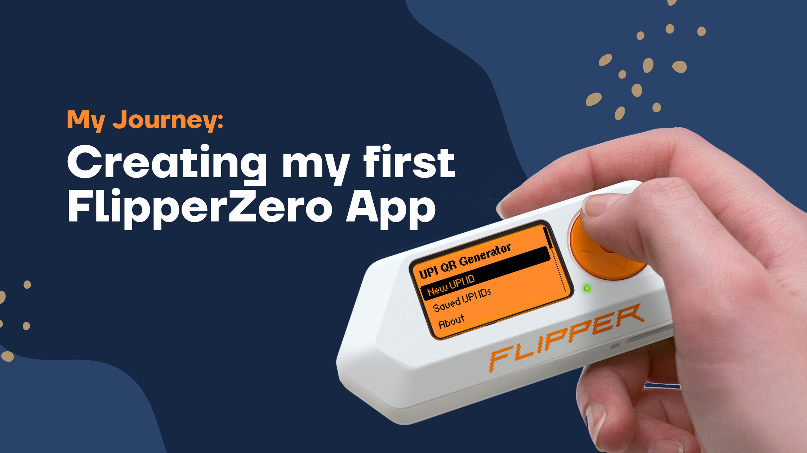

## My Journey: Creating my first FlipperZero App

Let me take you back to when I first got my hands on the Flipper Zero. Like any curious hacker, I was absolutely mesmerized by this orange Swiss army knife of the digital world. I spent weeks diving deep into its ecosystem - exploring apps, flashing custom firmwares, experimenting with GPIO pins, and playing with various attachments. Every day felt like Christmas morning!

But then, the inevitable question hit me: **"How do people actually make apps for this thing?"**

### The "Aha!" Moment

After some digging, I discovered that `.fap` files are essentially the `.apk` files of the Flipper Zero world. Mind blown! 🤯 Suddenly, the floodgates of possibilities opened up. I started brainstorming app ideas, frantically scribbling down concepts that could showcase the Flipper's capabilities.

But here's the thing - **everything I thought of already existed**. It felt like I was late to the party!

### The "Buy Me a Coffee" Inspiration

Then it struck me while browsing GitHub repositories with those familiar "Buy Me a Coffee" buttons. I thought, *"Why can't I have something similar for my Flipper Zero?"* But how could a pocket-sized device handle payments?

That's when the pieces clicked together: **UPI + QR codes + Flipper Zero = Magic!** 

What if my Flipper could host all the payment QR codes I need? Imagine just pulling out your Flipper, generating a QR code, and boom - payment received! It wasn't the most "hacky" or "techy" solution, but hey, **something is better than nothing**, right?

### The Development Reality Check

With excitement through the roof, I fired up my IDE and... well, let's just say I quickly realized why they call it "software development" and not "software magic." 😅 

**Truth bomb: I suck at coding.** 

But thankfully, we live in the age of AI assistants! *Thanks, AI - you really can take over the world (in the best way possible!)*

After countless hours of debugging, refactoring, and probably annoying my AI coding buddy with "why doesn't this work?" questions, we finally had our first version ready!

### The Ethical Hacker's Payment System

Now, here's where it gets fun. Picture this scenario: You've just demonstrated some WiFi deauth attacks or BLE spam to show security vulnerabilities to someone, and they're both amazed and slightly terrified. You could jokingly say, *"Pay me to stop!"* and whip out your Flipper with a ready-made UPI QR code! 😂

**But hey, I'm kidding!** Please use this app for **ethical purposes only**. I'm not here to promote or support any illegal activities. The real beauty is in legitimate use cases - from small businesses to tech demonstrations to just impressing your friends with your "hacker payment terminal."

### Why This Matters

In today's digital-first India, UPI has revolutionized how we handle money. With over 10 billion transactions worth ₹16 trillion processed in 2023 alone, India leads the world in real-time payments. So why not let our beloved Flipper Zero be part of this digital revolution?

That's exactly what I've built, and in this blog post, I'll walk you through everything you need to know about my **UPI QR Generator for Flipper Zero** - born from curiosity, powered by AI, and designed for the ethical hacker community.

---

## 🎥 Video Tutorial

Watch the complete tutorial on installing and using the UPI QR Generator:

**[🎬 Watch on YouTube: UPI QR Generator for Flipper Zero Tutorial](https://www.youtube.com/watch?v=CfScU56V5XM)**

[](https://www.youtube.com/watch?v=CfScU56V5XM)

---

## 🚀 What Makes This Project Special?

## ✨ Key Features

🎯 **Instant QR Generation** - Create UPI QR codes in seconds  
🏪 **Universal Bank Support** - Works with PhonePe, Paytm, GPay, and all UPI providers  
📱 **Fullscreen Display** - Optimized for easy mobile scanning  
💾 **Save & Store** - Keep your frequently used QR codes on device  
🎨 **Clean Interface** - Intuitive design that anyone can use  
⚡ **Offline Operation** - No internet connection required  

---

## 🛠️ Installation Guide

### Method 1: Direct Installation (Easiest)

1. **Download the App**
   ```bash
   # Visit the GitHub repository
   https://github.com/Anugrahsr/flipper-upi-qr-generator
   ```

2. **Install on Flipper Zero**
   - Download `upi_qr.fap` from releases
   - Copy to your Flipper Zero's `apps` folder
   - Restart your Flipper Zero

### Method 2: Build from Source

```bash
# Install build tools
pip install ufbt

# Clone the repository
git clone https://github.com/Anugrahsr/flipper-upi-qr-generator.git
cd flipper-upi-qr-generator

# Build the application
ufbt

# Install to connected Flipper Zero
ufbt launch
```

---

## 📱 How to Use the App

### Step 1: Launch the Application
Navigate to `Apps` → `Tools` → `UPI QR Generator` on your Flipper Zero.

### Step 2: Enter Your Details
- **UPI ID**: Input your payment ID (e.g., `john.doe@paytm`)
- **Payee Name**: Enter the display name for transactions

### Step 3: Generate & Display
The app instantly creates a QR code

### Step 4: Save or Share
- Press `OK` for fullscreen view
- Use save function to store frequently used codes
- Present the QR code for customers to scan

---

## 🔧 Technical Deep Dive

### QR Code Specifications
| Feature | Specification |
|---------|---------------|
| **Version** | QR Code Version 3 |
| **Error Correction** | ECC_LOW (7% recovery) |
| **Data Format** | UTF-8 with URL encoding |
| **Max Capacity** | 84 characters |
| **Display Size** | Optimized for 128x64 screen |

### UPI Protocol Implementation
The app generates QR codes using the official UPI payment string format:
```
upi://pay?pa=<UPI_ID>&pn=<PAYEE_NAME>&cu=INR
```

**Parameters explained:**
- `pa` (payee address): The recipient's UPI ID
- `pn` (payee name): Display name for the transaction
- `cu` (currency): Fixed to INR (Indian Rupees)

### Security Considerations
- ✅ **No data transmission** - Everything processes locally
- ✅ **No stored credentials** - Only generates display codes
- ✅ **Standard compliance** - Follows NPCI UPI guidelines
- ✅ **URL encoding** - Prevents injection attacks

---

## 🤝 Contributing to the Project

This is an open-source project, and contributions are welcome! Here's how you can help:

### For Developers
```bash
# Fork the repository
git clone https://github.com/Anugrahsr/flipper-upi-qr-generator.git

# Create feature branch
git checkout -b feature/amazing-feature

# Make your changes and test
ufbt

# Submit pull request
git push origin feature/amazing-feature
```

### For Users
- **Report bugs** on GitHub Issues
- **Suggest features** through GitHub Discussions
- **Share your use cases** in the community
- **Star the repository** to show support

---

## 🔗 Resources and Links

### Essential Links
- **📦 GitHub Repository**: [https://github.com/Anugrahsr/flipper-upi-qr-generator](https://github.com/Anugrahsr/flipper-upi-qr-generator)
- **📺 Video Tutorial**: [YouTube Link - Replace with your video]
- **🐛 Bug Reports**: [GitHub Issues](https://github.com/Anugrahsr/flipper-upi-qr-generator/issues)
- **💬 Community Discussion**: [GitHub Discussions](https://github.com/Anugrahsr/flipper-upi-qr-generator/discussions)

### Additional Resources
- **Flipper Zero Official**: [flipperzero.one](https://flipperzero.one)
- **UPI Guidelines**: [NPCI UPI Documentation](https://www.npci.org.in/what-we-do/upi)
- **QR Code Standards**: [ISO/IEC 18004 Specification](https://www.iso.org/standard/62021.html)

---

## 🎯 Conclusion

The UPI QR Generator for Flipper Zero represents more than just a cool hack - it's a practical solution to real-world payment challenges. By combining the versatility of the Flipper Zero with India's robust UPI infrastructure, we've created something that bridges the gap between cutting-edge hardware and everyday utility.

Whether you're a small business owner looking for an affordable payment solution, a tech enthusiast wanting to showcase Flipper Zero capabilities, or a developer interested in contributing to open-source projects, this app offers something valuable.

### What's Next?

1. **Try the App**: Download and install it on your Flipper Zero
2. **Join the Community**: Star the GitHub repository and engage with other users
3. **Share Your Experience**: Let us know how you're using the app
4. **Contribute**: Help make it even better with your ideas and code

---

## 🙏 Acknowledgments

Special thanks to:
- **Flipper Zero Team** for creating an incredible platform
- **NPCI** for developing the UPI ecosystem
- **Open Source Community** for continuous inspiration and support

---

*Found this blog post helpful? Share it with your fellow makers and don't forget to star the project on GitHub! Have questions or suggestions? Drop them in the comments below or reach out on GitHub.*

**Tags**: `#FlipperZero` `#UPI` `#DigitalPayments` `#OpenSource` `#India` `#QRCode` `#Tech` `#DIY` `#Electronics` `#Programming`

---

## 📝 License

This project is licensed under the MIT License - free for personal and commercial use. See the [LICENSE](https://github.com/Anugrahsr/flipper-upi-qr-generator/blob/main/LICENSE) file for details.

**⚠️ Disclaimer**: This application is for legitimate payment purposes only. Users are responsible for complying with local regulations and UPI provider terms of service.
