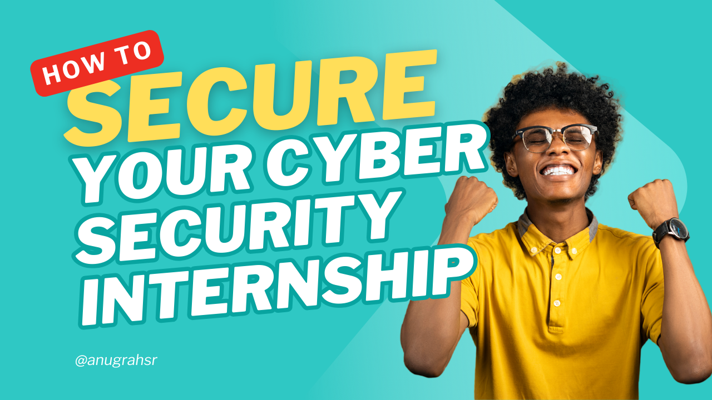
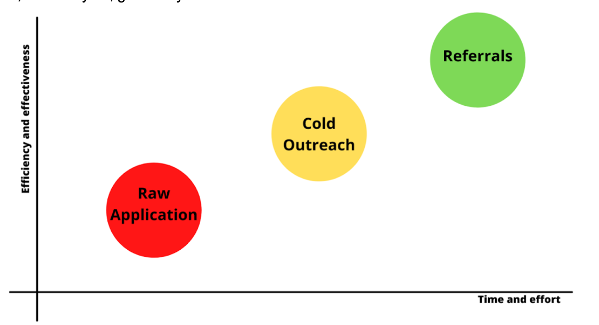

# Six points to consider if you want to land a cyber security internship

Before we begin, let me introduce myself. My name is Anugrah SR, and I'm currently working as a security specialist at HackerOne. You can read my journey of how a biologist became a cybersecurity professional from [my previous blog](/blogs/my-infosec-journey/). If I recall right, it was almost the same time last year, that is 2021, I was clueless how I will break into this field and land a job in infosec with a masters degree in life science. I was applying for internships in the dark without any strategy. The results were disappointing, and hence I know how hard it is to find an internship.

First of all, we all come from different backgrounds, so there is no perfect magic formula. Whether it’s attending meetups, completing online or offline courses, or completing a formal graduate-level degree, seeing some crazy hacker movie, ultimately everything paves way. This is what makes us unique and makes each others' infosec journey amazing. However, after attending a couple of interviews, going through job descriptions and chats with cybersecurity professionals, I noticed several common characteristics that one must possess, as well as steps that one ought to follow in order to improve one's chances of getting their foot in the door. I'll go over each topic one by one, and if you possess those qualities and follow the steps, you'll be well on your way to breaking into the field. At least that's how I broke into the field with my first internship in Securelayer7.

*Buckle up; your internship-hunt is going to get narrowed down into simpler steps!*

## Types of internships

Internships are beneficial in almost any industry, including cybersecurity. There is a severe lack of qualified and experienced cybersecurity professionals and internships are one way for new cybersecurity enthusiasts to gain the experience they need to enter the workforce.
Before we begin, it is critical to understand the various types of internships available, since not all of them are designed with the same rationale. You should conduct your own research and decide which internship is best suited for you.

[**Paid internships**](): The majority of job applicants will be looking for paid internships which can often lead to full-time employment offers. Paid internships are more likely to be offered by private corporations, large organizations and startups. They might be a little more hard to find and be offered unlike unpaid internships.

[**Unpaid internship**](): A more common form of internship usually for a short duration. Although they may not provide any compensation or financial boons, the skills and experience learned and gathered are invaluable for the future.

[**Internship for credits**](): Colleges and universities will often allow students the opportunity to earn college credits upon completing an internship. Schools will have varying requirements for internships in order to gain credits.

**Internship for credits**

Colleges and universities will often allow students the opportunity to earn college credits upon completing an internship. Schools will have varying requirements for internships in order to gain credits.
There will be paid training courses that are branded as internships, and a strong suggestion would be to stay away from these or be cautious.

## Skills
Start going after the skills right now! You really can’t expect to land into an internship without acquiring the minimum relevant skills. No the question is, how do you acquire these skills?
There is no one-size-fits-all solution for this. Albeit, what you can do is to take up online courses (available in plenty!) and often remind yourself that it’s not the certificate you’re after, but the skills. Everything can be found on the internet and can be learnt if you put in the effort.

Depending on the area you wish to work, for instance say web application pentest, you can start by learning from resources such as:

- [PortSwigger Web Security Academy](https://portswigger.net/web-security)
- [TryHackMe](https://tryhackme.com/)
- [HackTheBox](https://www.hackthebox.com/)
- CTFs
- Security blogs
- YouTube channels

Thanks to the internet and the will you hold, anything can be learnt for free! Whether it's a course, a book, or a YouTube video, there are plenty of resources available to help you learn the skills you need.

Do you need a college degree? Well, honestly, some companies require you to, but most are happy to hire you if you have the skills and thirst for knowledge. Having strong communication skills, be it in any form, is a big plus for your portfolio and a major component in the field. All that said, one should always have that fire burning inside to learn more and be persistent. 

Once you acquire the skills, how do you demonstrate them?

## Make a strong portfolio for yourself
The greatest method to brag about your abilities is to have a demonstrable portfolio. When it's there in front of the interviewer's eyes, it's so convincing!
>Make a strong portfolio for yourself. Be a contributor, curator or a builder.

Contribute to the community by writing blogs, making videos or helping others with their projects. For example in platforms such as github you can report issues, add improvements and push codes. One of the best examples for this will be nuclei templates github repo where you can contribute nuclei templates. Another useful project where you can contribute is how to hunt repo by Kathan Patel. These are just tips of the iceberg in the vast system of opportunites. 

Be a curator, collect amazing blogs, projects and resources in the field and organise them. You can make a github repo out of it, share them in the form of tweets or newsletter (Something that I personally do, and hence a self promo, cause why not! Subscribe to my newsletter)

If you are good with coding/scripting, make some tools/scripts that help you save your time in your work. You can be a content creator in different formats and platforms.

Overall, when it comes to any industry, branding yourself is essential. I completely understand if some of you are hesitant to share your work online or to show the world what you're working on. However, you must step outside of your comfort zone and start demonstrating to employers what you are capable of. It truly helped me show employers how enthusiastic and efficient I am.

## Work on your Resume
Employers utilise resumes to learn more about a candidate's abilities, skillsets, and experiences. Your resume should include achievements, awards, education, experience, and any other noteworthy information that is relevant to your career path and objectives. Most of the resumes I got to view recently were not upto the mark as they did not have the necessary details that an employer needs to know. The ultimate aim in this competitive field is that you need to stand out in the crowd! Competition is tough and you need to articulate your skills, achievements and your passion for the industry in limited words.
I would best suggest those interested to watch the following videos to get a clear understanding of how to make a better resume. I'd be more than happy to share a review if required! You can contact me for [resume review](https://topmate.io/anugrahsr/102255/pay) and for [interview preparation](https://topmate.io/anugrahsr/102259).

- [How to Create a Better Infosec Resume (with ​@jhaddix)! - Nahamsec](https://www.youtube.com/watch?v=Zs28J_SDXYQ)
- [Roasting Resumes - The Cyber Mentor](https://www.youtube.com/watch?v=vZkVY4DSAHc)
- [This Is My Resume… - John Hammond](https://www.youtube.com/watch?v=ZAt8MM8WG0o)

## Networking - Grow Your Network
I can't stress enough how critical networking really is, as you'll realize it’s rewards in the long term. Professionals in the field of cybersecurity have taught me a great deal. It's quite beneficial to learn about their backgrounds and how they got to where they are now in their careers. Even seeking resume advice from industry experts can make a big difference. Whether it's a direct message or a chat during a conference, make an effort to expand your network as much as possible. Linkedin and infosec twitter are great places to start building your network and if you don't have an account, create one immediately. I was able to secure my first internship and job through networking.

> You lose nothing by sending a "Hi" message, but can gain much more.

So let’s start connecting. Here are my twitter and linkedin profiles, and I would be happy to connect with you and help you in your journey. 
Send me a “Hi” if you found this blog useful and need any help. You can also reach out to me on twitter [@cyph3r_asr](https://x.com/cyph3r_asr) or linkedin [Anugrah S R](https://www.linkedin.com/in/anugrah-sr/).

## Smart Ways of applying
It goes without saying that this stage can be tiring or boring, but you will be surprised how quickly you can actually land interviews if you are smart about it.

[**Raw Application**](): Raw application means simply submitting your resume to job openings. Although this is an easy method, it also tends to have low efficiency.

[**Cold outreach**](): Once you apply for a job via LinkedIn or on the company website, try to find the people that work on the cybersecurity team for the company that you’d applied for. Send them a message and explain why you would be the ideal candidate for this position. Sometimes, they connect you with the hiring manager or with someone else in the company. You might not always hear back, but the chances of landing in an interview are much higher than just applying online.

[**Referrals**](): This is the quickest way that will lead you to interviews. I received some referrals from people I met through my networking efforts which is why networking is an important aspect. Once you build a connection with someone who works in the field and he/she sees that you are passionate and could be a potential asset, they will try to help you out. Don’t expect all of them to do that for you, but if they do, great for you.

## Prepare and practice for interviews

It's essential to give your absolute best in the interview. That's the only way you'll be evaluated, and don't disappoint your referrer. Practice, practise, and practise some more. There's no getting around it. I'm not going to go into too much detail because there are so many resources available. Look up popular interview questions and brush up on your theory. Take turns practicing a mock interview with a friend or AI chatbot. It can assist you in reducing any anxiety you may have in front of the interviewer. When you practise answering in this manner, you will gain a better understanding of how to frame your responses. 

It’s okay to ask for feedback from the interviewer once it’s over. Sometimes you will not get the offer even after everything went right from your part, company requirements and situation can change, don't be sad. Pick yourself up and keep improving yourself, acquire even more skills, and have a couple of more projects. Build a stronger professional network.
Then employers will be running behind you.

## Before you go
Thank you for taking the time to read this far. I hope you found it useful in some manner. Above all, please forward this to someone who is looking for an internship. If you require additional assistance with any of these processes, please do not hesitate to contact us.
I would be delighted to connect with you on LinkedIn and receive your feedback. I'm excited to watch you succeed!

> "The only way to do great work is to love what you do." - Steve Jobs

